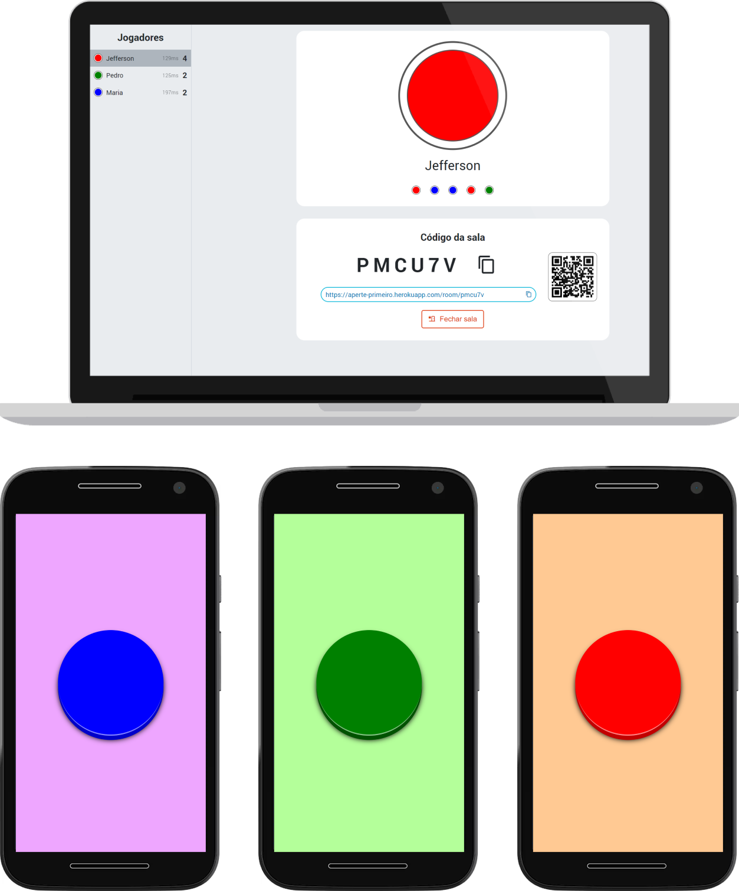

# Aperte Primeiro

Baseado no jogo Passa ou Repassa, o Aperte Primeiro simula os botões e a sirene utilizando apenas celulares ou computadores.

Ideal para jogos de perguntas em que um jogador deve apertar primeiro o botão para responder.

É possível criar várias salas e não há limite para o número de jogadores, além disso ele também marca o placar!



## Tecnologias utilizadas


## Instruções
### 1. Instalação
```bash
git clone https://github.com/josejefferson/aperte-primeiro
cd aperte-primeiro
yarn
```

### 2. Executar
#### Modo de desenvolvimento
```bash
yarn dev
```

#### Modo de produção
```bash
yarn build
yarn start
```
